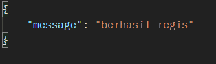

Endpoints

**Users**

  _Register_
  
  URL : (/auth/register)

  Method : POST

  Request body : 
  name as string
  username as string
  email as string
  password as string

  Response : 
  
  

  _Login_

  URL : (/auth/login)

  Method : POST

  Request body : 
  name as string
  username as string
  email as string
  password as string

  Response : https://github.com/possible112/backEnd-TA/issues/1#issue-1990435110

  _See All Users_

  URL : (/users)

  Method : GET

  Response :

  _See User by Id_

  URL : (/users/:id)

  Method : GET

  Response :
  
  _Delete User by Id_

  URL : (/users/:id)

  Method : DELETE

  Response :

  _Update User by Id_

  URL : (/users/:id)

  Method : PUT

  Request body : 
  name as string
  username as string
  email as string
  password as string

  Response :

**Todos**

  _createTodo_

  URL : (/todos)

  Method : POST

  Headers : Authorization Bearer <token>

  Request body : 
  value as string
  status as boolean
  user_id as integer

  Response : 

  _See All Todos_

  URL : (/todos)

  Method : GET

  Headers : Authorization Bearer <token>

  Response :  

  _See Todo by Id_

  URL : (/todos/:id)

  Method : GET

  Headers : Authorization Bearer <token>

  Response :  

  _Delete All Todos_

  URL : (/todos)

  Method : DELETE

  Headers : Authorization Bearer <token>

  Response :  

  _Delete Todo by Id_

  URL : (/todos/:id)

  Method : DELETE

  Headers : Authorization Bearer <token>

  Response :  

  _Update Todo by Id_

  URL : (/todos/:id)

  Method : PUT

  Headers : Authorization Bearer <token>

  Response : 
  

  
